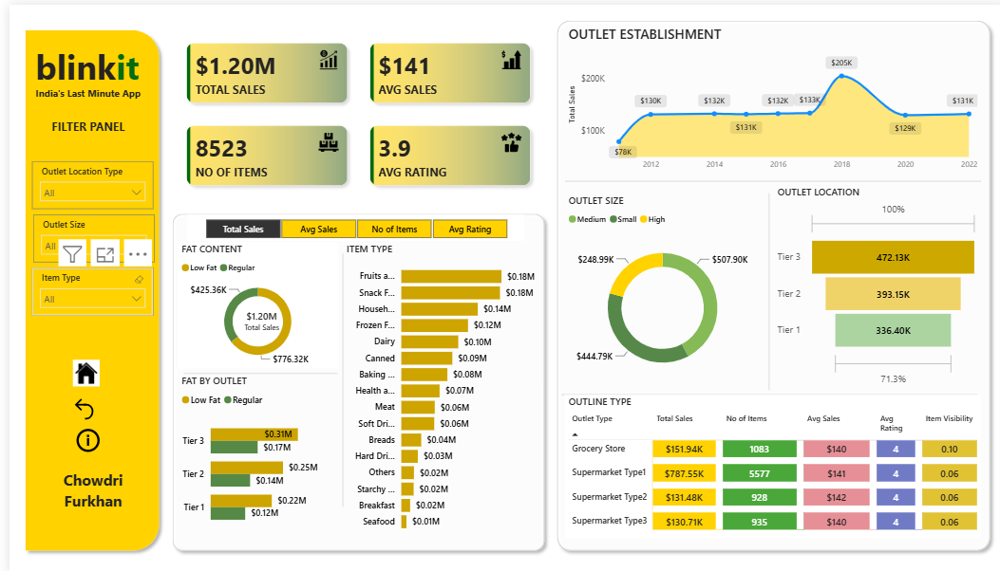

# 🛒 Blinkit Retail Intelligence Dashboard

An end-to-end retail analytics project analyzing **8,523 grocery sales records** from Blinkit - India's last-minute delivery app - to uncover sales trends across product categories, outlet types, locations, and customer ratings. The project combines **MySQL** for data cleaning and querying with **Power BI** for interactive visualization.

---

## 📌 Project Overview

Blinkit operates thousands of SKUs across multiple outlet formats (Grocery Stores, Supermarket Type 1/2/3) and outlet tiers (Tier 1–3). This project answers key business questions:

- What is the total and average sales performance across the business?
- Which item categories and fat-content segments drive the most revenue?
- How does outlet size, location tier, and establishment year affect sales?
- Which outlet type performs best on sales, ratings, and visibility?

The workflow follows a real-world BI pipeline: **raw data → SQL cleaning & aggregation → Power BI modeling & visualization.**

---

## 📁 Repository Structure

| File | Purpose |
|---|---|
| `BlinkIT_Grocery_Data.csv` | **Raw dataset used for MySQL.** Imported into a MySQL database (`blinkit_data`) for data cleaning and exploratory SQL analysis. |
| `Blinkit_analysis.sql` | All MySQL queries - data standardization (fat content categories) and aggregate analysis (total sales, average sales, ratings, sales by outlet/item type, etc.). |
| `BlinkIT_Grocery_Data.xlsx` | **Cleaned dataset used as the Power BI data source.** This is the Excel version of the cleaned data, connected directly to the `.pbix` file for the dashboard's data model. |
| `BlinkIT_PowerBI_Dashboard.pbix` | The full interactive Power BI dashboard file - open in Power BI Desktop to explore. |
| `Dashboard_Preview.png` | Static preview image of the dashboard. |

> ⚠️ **Note on file roles:** The `.csv` file was used exclusively for the **MySQL** analysis stage (queries in `Blinkit_analysis.sql`). The `.xlsx` file is the dataset actually loaded into and used by the **Power BI** dashboard (`.pbix`). Both files contain the same underlying data, cleaned for their respective tools.

---

## 🧹 Data Cleaning (MySQL)

Performed in `Blinkit_analysis.sql`:
- Standardized inconsistent `Item_Fat_Content` labels (`LF`, `low fat` → `Low Fat`; `reg` → `Regular`)
- Verified distinct category values post-cleaning
- Built aggregate queries for sales, ratings, and item counts to validate metrics before visualizing

---

## 📊 Dashboard Highlights (Power BI)

**Key Metrics**
- 💰 Total Sales: **$1.20M**
- 📈 Average Sales: **$141**
- 📦 No. of Items: **8,523**
- ⭐ Average Rating: **3.9**

**Visual Breakdowns**
- **Sales by Fat Content** - Low Fat vs. Regular, overall and by outlet tier
- **Sales by Item Type** - Fruits & Vegetables and Snack Foods lead at $0.18M each
- **Outlet Establishment Trend** — sales performance by the year each outlet opened (2012–2022)
- **Outlet Size Distribution** — Small, Medium, and High outlets by sales contribution
- **Outlet Location Type** — Tier 1, Tier 2, and Tier 3 sales comparison
- **Outlet Type Summary Table** — Total Sales, No. of Items, Avg Sales, Avg Rating, and Item Visibility for Grocery Store, Supermarket Type 1, Type 2, and Type 3

**Interactivity**
- Filter panel for **Outlet Location Type**, **Outlet Size**, and **Item Type**
- Fully cross-filtered visuals — clicking any chart updates the entire report page

---

## 🛠️ Tools & Tech Stack

| Tool | Role |
|---|---|
| **MySQL** | Data cleaning, standardization, and exploratory aggregate analysis |
| **Excel** | Cleaned data source feeding the Power BI model |
| **Power BI Desktop** | Data modeling, DAX measures, and interactive dashboard design |

---

## 🚀 How to Explore This Project

1. **Review the SQL analysis:** Open `Blinkit_analysis.sql` in any MySQL client to see the cleaning steps and aggregate queries run against `BlinkIT_Grocery_Data.csv`.
2. **Open the dashboard:** Open `BlinkIT_PowerBI_Dashboard.pbix` in **Power BI Desktop** (the file is connected to `BlinkIT_Grocery_Data.xlsx`).
3. **Interact:** Use the filter panel on the dashboard to slice by Outlet Location Type, Outlet Size, or Item Type.

---

## 📈 Key Insights

- **Fruits & Vegetables** and **Snack Foods** are the top-performing item categories by sales.
- **Regular** fat-content items ($0.78M) outsell **Low Fat** items ($0.43M) overall.
- **Tier 3** locations generate the highest sales ($472K), followed by Tier 2 ($393K) and Tier 1 ($336K).
- Outlets established around **2018** show a notable sales spike ($205K) compared to surrounding years.
- **Supermarket Type 1** leads in total sales ($787.55K) despite having more items than Grocery Stores, while maintaining a consistent average rating of 4.

---

## 📄 License

This project is licensed under the [MIT License](LICENSE) — feel free to use, modify, and share with attribution.

---

## 👤 Author

**Chowdri Furkhan**

- GitHub: [Chowdri-Furkhan07](https://github.com/Chowdri-Furkhan07)
- LinkedIn: [linkedin.com/in/chowdri-furkhan](https://linkedin.com/in/chowdri-furkhan/)

*Open to Data Analyst and Data Scientist opportunities.*
